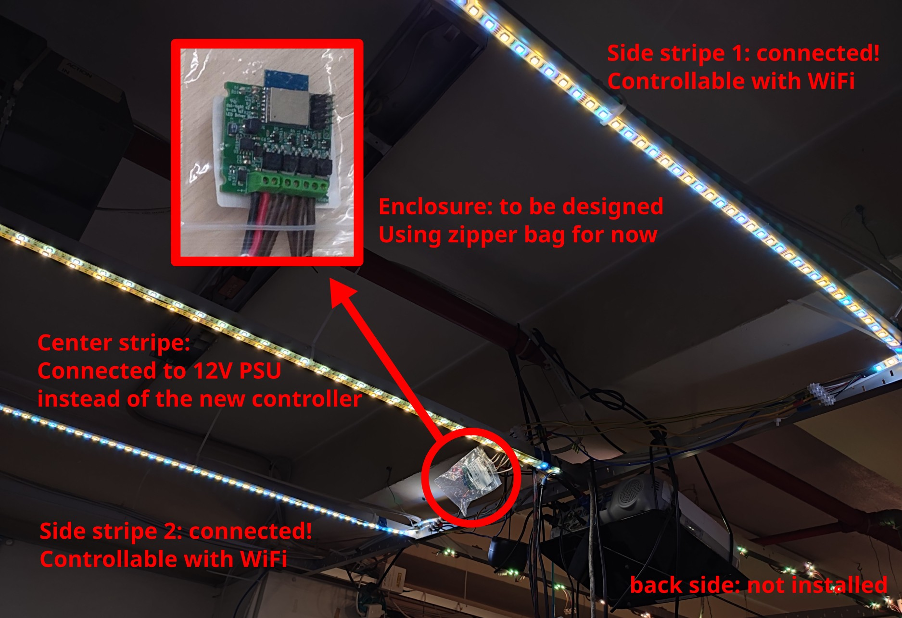
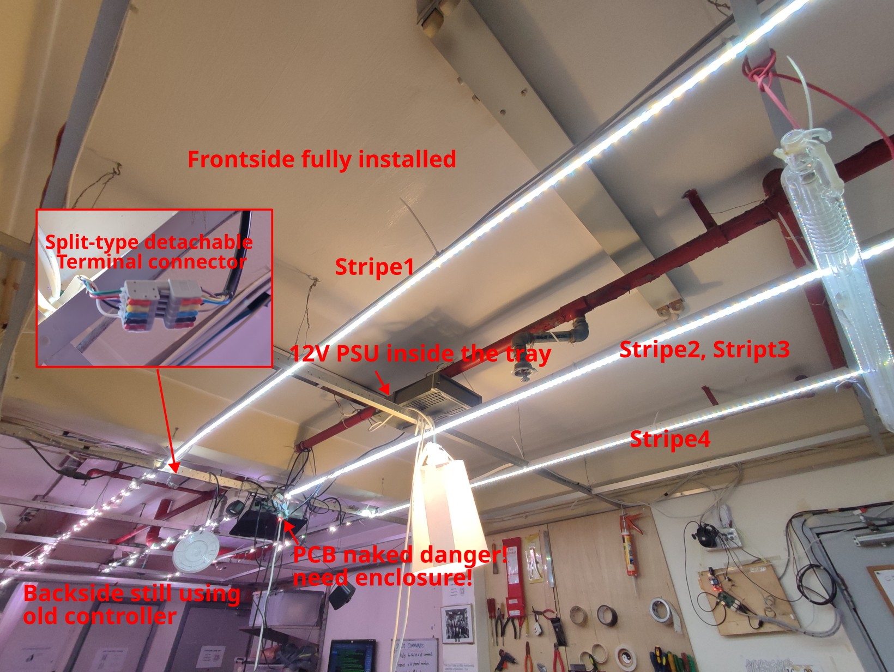

# dsl-light v2 (ilo suno)

This repo contains the electronic design files of the new revision of DSL's RGBW LED driver board.

The original one was designed by lionello. Since I don't have Eagle, I'm redrawing the whole thing. I made the following enhancements:

* Added white LED channel
* Using ESP-WROOM-02 instead of ESP12. Both are ESP8266-based chip.
* Added bypass capacitors
* Added reverse polarity protection for voltage regulator input
* Using SMD components except for connectors
* Added mounting holes
* Replaced LDO with DC-DC buck converter
* Added power indicator
* Added programming header and removed unneeded programming button
* Added GPIO header for potential future expansion
* Replaced first-stage BJT with MOSFET
* Added gate resistor to MOSFET
* Added Dimsumlabs' logo and other info on silk mark

This new hardware design is backward-compatible with the original firmware.

## Installation Progress in DSL

2024-08-14:

2024-10-29:

TODO:

* Fix helios DNS resolution
* Install another set of new LEDs on backside

## Credit

* lionello - For making the original design and the firmware
* Sadale - For revising the hardware
* nigel - for reviewing the hardware design
* trouble - for proposing starting this project and reviewing the hardware design
* Other DSL members - for getting the whole thing installed to DSL, maintaining the firmware, etc.
